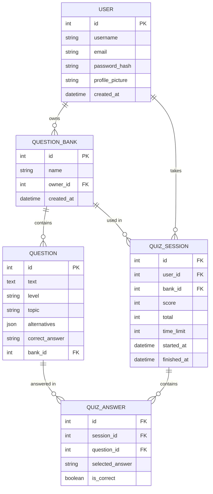

# Data Modeling

```mermaid
erDiagram
    USER {
        int id PK
        string username
        string email
        string password_hash
        string profile_picture
        datetime created_at
    }

    QUESTION_BANK {
        int id PK
        string name
        int owner_id FK
        datetime created_at
    }

    QUESTION {
        int id PK
        text text
        string level
        string topic
        json alternatives
        string correct_answer
        int bank_id FK
    }

    QUIZ_ANSWER {
        int id FK
        int session_id FK
        int question_id FK
        string selected_answer
        boolean is_correct
    }

    QUIZ_SESSION {
        int id FK
        int user_id FK
        int bank_id FK
        int score
        int total
        int time_limit
        datetime started_at
        datetime finished_at
    }

    USER ||--o{ QUESTION_BANK : "owns"
    USER ||--o{ QUIZ_SESSION : "takes"
    QUESTION ||--o{ QUIZ_ANSWER : "answered in"
    QUIZ_SESSION ||--o{ QUIZ_ANSWER : "contains"
    QUESTION_BANK ||--o{ QUESTION : "contains"
    QUESTION_BANK ||--o{ QUIZ_SESSION : "used in"
```