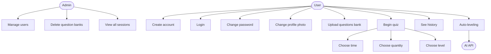

# Use Cases

```mermaid
graph TD
    U([User])
    A([Admin])

    A --> UC12[Manage users]
    A --> UC13[Delete question banks]
    A --> UC14[View all sessions]

    U --> UC1[Create account]
    U --> UC2[Login]
    U --> UC3[Change password]
    U --> UC4[Change profile photo]
    U --> UC5[Upload questions bank]
    U --> UC6[Begin quiz]
    U --> UC7[See history]
    U --> UC8[Auto-leveling]

    UC6 --> UC9[Choose time]
    UC6 --> UC10[Choose quantity]
    UC6 --> UC11[Choose level]

    UC8 --> AI([AI API])
```