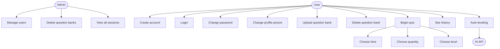

# Use Cases

```mermaid
graph TD
    U([User])
    A([Admin])

    A --> A1[Manage users]
    A --> A2[Delete question banks]
    A --> A3[View all sessions]

    U --> UC1[Create account]
    U --> UC2[Login]
    U --> UC3[Change password]
    U --> UC4[Change profile picture]
    U --> UC5[Upload question bank]
    U --> UC6[Delete question bank]
    U --> UC7[Begin quiz]
    U --> UC8[See history]
    U --> UC9[Auto-leveling]

    UC7 --> UC10[Choose time]
    UC7 --> UC11[Choose quantity]
    UC7 --> UC12[Choose level]

    UC9 --> AI([AI API])
```